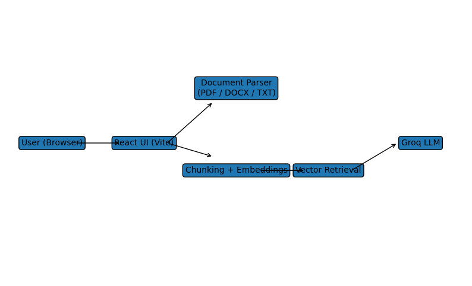

# AI Intern Assignment – Document Q&A Assistant (RAG)

## Overview
This project implements a **Retrieval-Augmented Generation (RAG) based Document Question Answering Assistant**.  
Users can upload documents and ask questions; the system retrieves relevant document sections and generates grounded answers **with citations**.

The solution is built as a **web application** using **Vite + React**, follows the assignment requirements, and is ready for deployment.

---
## Live app : https://document-qa-rag-ten.vercel.app/
## Features
- Upload documents in **PDF, DOCX, TXT, MD** formats
- Extract and preprocess document text
- Chunk documents into overlapping segments
- Generate embeddings for each chunk
- Retrieve top-k relevant chunks using cosine similarity
- Generate answers using **Groq LLM**
- Display **citations for every answer**
- Clear chat and reset knowledge base options
- Clean, responsive UI

---

## Tech Stack
- **Frontend:** React, Vite
- **Styling:** Tailwind CSS
- **Document Parsing:** pdfjs-dist, mammoth
- **Embeddings:** Lightweight in-browser embeddings
- **LLM:** Groq (LLaMA 3.1)
- **Environment Config:** `.env`

---

## Architecture Diagram



---

## System Architecture (Explanation)
1. **User uploads document**
2. **Text extraction**
   - PDF → pdfjs
   - DOCX → mammoth
   - TXT/MD → plain text
3. **Chunking**
   - 500-word chunks with 100-word overlap
4. **Embedding Generation**
   - Lightweight vector embeddings stored in memory
5. **Query Processing**
   - User question embedded
   - Cosine similarity used to retrieve top-k chunks
6. **LLM Generation**
   - Context + question sent to Groq LLM
7. **Response with Citations**
   - Answer displayed along with source document sections

---

## How to Run Locally

### 1. Clone the repository
```bash
git clone https://github.com/surabhi-chandrakant/document-qa-rag
cd doc_rag_vite
```

### 2. Install dependencies
```bash
npm install
```

### 3. Configure environment variables
Create a `.env` file:
```env
VITE_GROQ_API_KEY=your_groq_api_key
```

### 4. Start the development server
```bash
npm run dev
```

Open: http://localhost:5173

---

## Example Questions
- What is this document about?
- What are the main objectives?
- What tools or technologies are mentioned?
- Summarize Section 3 of the document.

---

## Assignment Compliance Checklist
- [x] Document upload and parsing
- [x] Chunking and embeddings
- [x] Vector-based retrieval
- [x] LLM-powered answers
- [x] Citations for answers
- [x] Clear chat option
- [x] Reset knowledge base option
- [x] Web-based UI

---

## Notes
- Embeddings are stored in-memory for simplicity.
- Architecture can be extended to use MongoDB Atlas Vector Search or FAISS in production.

---


